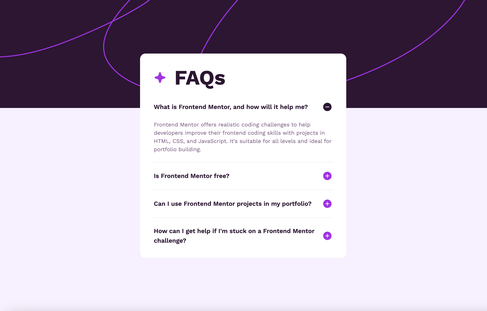

# Frontend Mentor - FAQ accordion solution

This is a solution to the [FAQ accordion challenge on Frontend Mentor](https://www.frontendmentor.io/challenges/faq-accordion-wyfFdeBwBz). Frontend Mentor challenges help you improve your coding skills by building realistic projects.

## Table of contents

- [Overview](#overview)
  - [The challenge](#the-challenge)
  - [Screenshot](#screenshot)
  - [Links](#links)
- [My process](#my-process)
  - [Built with](#built-with)
  - [What I learned](#what-i-learned)
  - [Useful resources](#useful-resources)
- [Author](#author)

## Overview

### The challenge

Users should be able to:

- Hide/Show the answer to a question when the question is clicked
- Navigate the questions and hide/show answers using keyboard navigation alone
- View the optimal layout for the interface depending on their device's screen size
- See hover and focus states for all interactive elements on the page

### Screenshot



### Links

- Solution URL: [https://github.com/maryam-nasir/fm-faq-accordion](https://github.com/maryam-nasir/fm-faq-accordion)
- Live Site URL: [Add live site URL here](https://your-live-site-url.com)

## My process

### Built with

- Semantic HTML5 markup
- Tailwind CSS
- Flexbox
- [React](https://reactjs.org/) - JS library

### What I learned

While working on this project, I learnt how to write accessible HTML and implement keyboard navigation to access different items in accordion:

```
<div> <!-- accordion container -->
  <h3>
    <button id="first" aria-expanded="false" aria-controls="panel1">first accordion title</button>
  </h3>
  <div id="panel1" aria-labelledby="first">
    <!-- contents of your panel -->
  </div>
  <h3>
    <button id="second" aria-expanded="false" aria-controls="panel2">second title</button>
  </h3>
  <div id="panel2" aria-labelledby="second">
    <!-- contents of your panel -->
  </div>
</div>
```

### Useful resources

- [Implement accessible accordions - example](https://stackoverflow.com/questions/48156930/how-can-i-make-my-accordion-accessible-by-keyboard-screen-readers)

## Author

- LinkedIn - [Maryam Nasir](https://www.linkedin.com/in/maryam-nasir/)
- Frontend Mentor - [@maryam-nasir](https://www.frontendmentor.io/profile/maryam-nasir)
- Twitter - [@maryamnasir555](https://twitter.com/maryamnasir555)
